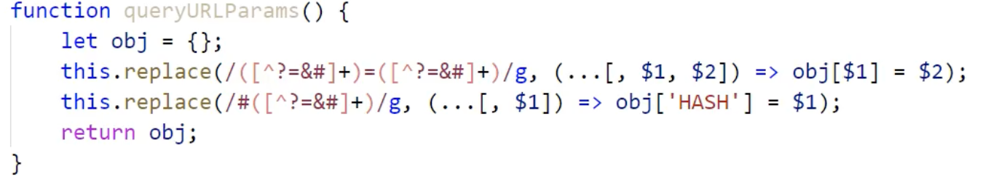

# 正则表达式

正则表达式是匹配模式，要么匹配字符，要么匹配位置。

## 1.正则表达式两种创建方式

+ 字面量创建方式(两个斜杠之间包起来的，都是用来描述规则的元字符)

  ```js
  let reg1 = /\d+/;
  ```

+ 构造函数模式创建 两个参数：元字符字符串，修饰符字符串

  ```js
  let reg2 = new RegExp("\\d+")
  ```

+ 正则两种创建方式的区别

  ```js
  //1. 构造函数因为传递的是字符串，\需要写两个才代表斜杠
  let reg = /\d+/g;
  reg = new RegExp('\\d+',"g")
  
  //2. 正则表达式中的部分内容是变量存储的值
  //两个斜杠中间包起来的都是元字符 如果正则中要包含某个变量的值，则不能使用字面量方式创建
  let type = "zhufeng"
  reg = /^@"+type+"@$/
  console.log(reg.test("@zhufeng@"));//false
  console.log(reg.test('@"""typeeeeee"@'));//true
  
  reg = new RegExp("^@"+type+"@$")
  console.log(reg.test("@zhufeng@"));//true
  
  ```


## 2. 正则表达式由两部分组成

+ 元字符

  ```js
  //常用元字符
  //1. 量词元字符：设置出现的次数
  *     零到多次
  +     一到多次
  ？    零次或一次
  {n}   出现n次
  {n,}  出现n到多次
  {n,m} 出现n到m次
  
  //2. 特殊元字符： 单个或者组合在一起代表特殊的含义
  \      转义字符
  .      除\n(换行符)以外的任意字符 
  ^      以哪一个元字符作为开始
  $      以哪一个元字符作为结束
  \n     换行符
  \d     0-9之间的一个数字
  \D     非0-9之间的一个数字
  \w     数字、字母、下划线中的任意一个字符
  \s     一个空白字符(包含空格、制表符、换行符等)
  \t     一个指标符
  \b     匹配一个单词的边界
  x|y    x或者y中的一个字符
  [xyz]  x或者y或者z中的一个字符
  [^xy]  除了x/y以外的任意字符
  [a-z]  指定a-z这个范围中的任意字符
  ()     正则中的分组符号
  (?:)	 只匹配不捕获
  (?=)   正向预查
  (?!)   负向预查
  
  //3. 普通元字符：代表本身含义
  /zhufeng/ 此正则匹配的就是"zhufeng"
  ```

+ 修饰符

  ```
  i => 忽略单词大小写匹配
  m => 可以进行多次匹配
  g => 全局匹配
  ```

## 3. 元字符详细解析

1. []中出现的字符一般都代表本身的含义

   ```js
   let reg = /^[@+]$/;
   console.log(reg.test('@')); //true
   console.log(reg.test('+')); //true
   console.log(reg.test('@@')); //false
   console.log(reg.test('@+')); //false
   
   reg = /^[\d]$/; //=>\d在中括号中还是0-9
   console.log(reg.test('d')); //false
   console.log(reg.test('\\')); //false
   console.log(reg.test('9')); //true
   
   //中括号中不存在多位数
   reg = /^[18]$/;
   console.log(reg.test('1')) //true
   console.log(reg.test('8')) //true
   console.log(reg.test('18')) //false
   
   reg = /^[10-29$/; //=>1或者0-2或者9
   console.log(reg.test('1')) //true
   console.log(reg.test('9')) //true
   console.log(reg.test('2')) //true
   console.log(reg.test('10')) //false
   ```

2. 小括号分组的第二个作用：分组捕获，不仅可以把大正 则匹配的信息捕获到，还可以单独捕获到每个小分组的内容。

   ```js
   let reg = /^(\d{6})(\d{4})(\d{2})\d{2}(\d)(\d|x)$/;
   reg.exec('330724200011232010'); 
   //["330721200011232010", '330724','2000','11','23','1','0'] 
   // 捕获结果是数组，包含每一个小分组单独获取的内容
   ```

## 4.正则的捕获

实现正则捕获的办法

+ 正则RegExp.prototype上的办法

  + **exec**

    **基于exec实现正则的捕获**

    1. 捕获到的结果是null或者一个数组

       第一项：本次捕获到的内容

       其余项：对应小分组本次单独捕获

       index：当前捕获内容在字符串中的起始索引

       input：原始字符串

    2. **正则的懒惰性**

       每执行一次exec，只能捕获到一个符合正则规则的，但是默认情况下，我们执行一百遍，获取的结果永远都是第一个匹配到的，其余的捕获不到。

       reg.lastIndex:当前正则下一次匹配的起始索引位置

       懒惰性捕获的原因：默认情况下lastIndex的值不会被修改，每一次都是从字符串开始位置查找，所以找到的永远只是第一个。

       解决办法：全局修饰符 g

       ```js
       let str = 'zhufeng2019yangfan2020qihang2021'
       let reg = /\d+/;
       console.log(reg.lastIndex); //0 下面匹配捕获是从str索引0的位置开始找
       console.log(reg.exec(str));
       console.log(reg.lastIndex);// 0 第一次匹配捕获完成，lastIndex没有改变，所以下一次exec依然是从字符串最开始找，找到的永远是第一个匹配到的
       
       let reg = /\d+/g;
       console.log(reg.exec(str));// ["2019"...]
       console.log(reg.lastIndex);// 11 设置全局匹配修饰符g后，第一次匹配完，lastIndex会自动修改
       
       console.log(reg.exec(str));// ["2020"...]
       console.log(reg.lastIndex);// 22
       
       console.log(reg.exec(str));// ["2021"...]
       console.log(reg.lastIndex);// 32
       
       console.log(reg.exec(str));// null 全部捕获后，再次捕获的结果是null，但是lastIndex又回归了初始值0，再次捕获又从第一个开始。
       console.log(reg.lastIndex);// 0
       ```

       

       ```js
       // 循环捕获execAll函数(等于字符串提供的match方法)
       ~(function () {
         function execAll(str = "") {
           //str:要匹配的字符串
           //this:RegExp的实例
           //进来后的第一件事，需要验证正则是否设置了g，否则会导致死循环
           if (!this.global) return this.exec(str);
           // ary存储最后所有捕获的信息 res存储每一次捕获的内容（数组）
           let ary = [],res = this.exec(str);
           while (res) {
             ary.push(res[0]);// 把每次捕获的内容res[0]存放到数组中
             res = this.exec(str);// 只要捕获的内容不为NULL，则继续捕获下去
           }
           return ary.length === 0 ? null : ary;
         }
         RegExp.prototype.execAll = execAll;
       })();
       let reg = /\d+/g;
       let str = "zhufeng2019yangfan2020qihang2021";
       console.log(reg.execAll(str));//['2019', '2020', '2021']
       console.log(str.match(reg));//['2019', '2020', '2021']
       ```

    3. **正则的贪婪性**

       

       

    4. ？在正则的五种用途：	

    **正则的分组捕获**

    1. 多次匹配的情况下，match只能把大正则匹配的内容获取到，小分组匹配的信息无法获取

       ```js
       let reg = /\{(\d+)\}/g;
       let str = "{0}年{1}月{2}日";
       console.log(str.match(reg));//["{0}", "{1}", "{2}"]
       let aryBig = [],arySmall = [], res = reg.exec(str);
       while(res){
       	let [big,small] = res;
       	aryBig.push(big);
       	arySmall.push(small);
       	res = reg.exec(str);
       }
       console.log(artBig,arySmall)//["{0}", "{1}", "{2}"] ["0", "1", "2"]
       ```

    2. 分组的第三个作用："分组引用"

       ```js
       let str = "book"; // "good" "moon" "look"
       let reg = /^[a-zA-Z]([a-zA-Z])\1[a-zA-Z]$/
       //分组引用就是通过“\数字”让其代表和对应分组出现一模一样的内容
       console.log(reg.test('book'))//true
       console.log(reg.test('soon'))//true
       console.log(reg.test('some'))//false
       ```

  + test 

+ 字符串String.prototype上支持正则表达式处理的办法

  + replace

    replace字符串中实现替换的方法（一般都是伴随正则一起使用的）

    ```js
    let str = "zhufeng@2019|zhufeng@2020";
    //把zhufeng替换成"珠峰"
    //1. 不用正则，执行一次只能替换一个
    str = str.replace("zhufeng","珠峰").replace("zhufeng","珠峰")
    //2. 用正则会简单点
    str = str.replace(/zhufeng/g,"珠峰");   
    ```

    案例：

    ```js
    // 1. 日期格式化
    let time = "2019-08-13";// 变为“2019年08月13日”
    let reg = /^(\d{4})-(\d{1,2})-(\d{1,2})$/
    time = time.replace(reg, "$1年$月$日")；
    
    //还可以这样处理 [str].replace([reg],function)
    //首先拿reg和time进行匹配捕获，能匹配几次就会把传递的函数执行几次
    time = time.replace(reg,(...arg)=>{
      let [,$1,$2,$3] = arg;
      $2.length<2 ? $2 = "0" + $2 : null;
      $3.length<2 ? $3 = "0" + $3 : null;
    	return $1 + "年" + $2 + "月" + $3 + "日"
    })
    // 2. 单词首字母大写
    let reg = /\b([a-zA-Z])[a-zA-Z]*\b/g;
    let str = "good good study, day day up";
    str = str.replace(reg, (...arg) => {
      let [content, $1] = arg;
      return $1.toUpperCase() + content.substring(1);
    });
    console.log(str);//Good Good Study, Day Day Up
    ```

  + match

  + splite

  + ......


## 5. 正则表达式之时间字符串格式化、queryUrlParams与千分符

**时间字符串格式化**


**queryURLparams**



**千分符**


